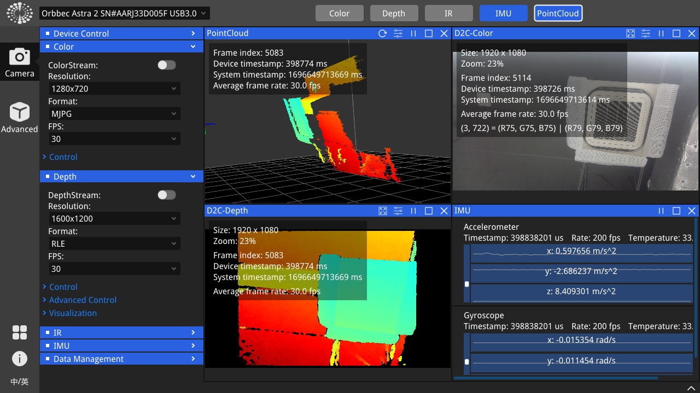

# Orbbec SDK

 

The Orbbec 3D camera product software development kit，fully supports UVC, realizes driver-free plug-and-play, provides low-level and high-level simple and easy-to-use APIs, and helps developers use it flexibly in different scenarios.

Besides, this SDK is compatible with Orbbec's original OpenNI protocol devices through built-in code, so that developers can completely migrate to Orbbec SDK to support Orbbec's new generation of products and old products with one set of code.

## What is included in the repository

* **library** : Orbbec SDK core library files and C/C++ header files.
* **examples** : C/C++ samples project source code.
* **doc** : API reference documentation and sample documentation.
* **driver** : Windows device driver for OpenNI protocol devices (Dabai, Dabai DCW, Dabai DW, Astra mini Pro, Astra Pro Plus, A1 Pro, Gemini E, Gemini E Lite, Gemini). While modules that use the standard UVC protocol do not need to install drivers.
* **scripts** : Linux udev rules for resolving permission issues and Windows timestamp registration scripts for resolving timestamp and metadata issues.

## Platform support

Windows 10, Ubuntu 16.04/18.04/20.04, ARM Linux 32/64 bit (Raspberry Pi 4B, Jetson Nano, A311D etc.)

*Windows 11, Ubuntu 22.04 and other Linux platforms may also be supported, but have not been fully tested.*

## Product support

| **products list** | **firmware version** |
| --- | --- |
| Gemini 2 XL      | Obox: V1.2.5  VL:1.4.54    |
| Astra 2          | 2.8.20                     |
| Gemini 2 L       | 1.4.32                     |
| Gemini 2         | 1.4.60 /1.4.76             |
| Femto Mega       | 1.1.7  (window10、ubuntu20.04、ubuntu22.04)  |
| Femto Bolt       | 1.0.6  (unsupported ARM32) |
| Astra+           | 1.0.22/1.0.21/1.0.20/1.0.19 |
| Femto            | 1.6.7                       |
| Femto W          | 1.1.8                       |
| DaBai            | 2436                        |
| DaBai DCW        | 2460                        |
| DaBai DW         | 2606                        |
| Astra Mini Pro   | 1007                        |
| Gemini E         | 3460                        |
| Gemini E Lite    | 3606                        |
| Gemini           | 3.0.18                      |
| Astra Mini S Pro | 1.0.05                      |

## Getting started

### Get source code

```bash
git clone https://github.com/orbbec/OrbbecSDK.git
```

### Environment setup

* Linux:

    Install udev rules file

    ``` bash
    cd OrbbecSDK/misc/scripts
    sudo chmod +x ./install_udev_rules.sh
    ./install_udev_rules.sh
    ```

* Windows:

    Timestamp registration: [follow this: obsensor_metadata_win10](misc/scripts/obsensor_metadata_win10.md)

### 4.3 Use OrbbecSDK in your CMake project

Find and link Orbbec SDK in your CMakeLists.txt file like this:

```cmake
cmake_minimum_required(VERSION 3.1.15)
project(OrbbecSDKTest)

add_executable(${PROJECT_NAME} main.cpp)

# find OrbbecSDK
set(OrbbecSDK_DIR "/your/path/to/OrbbecSDK")
find_package(OrbbecSDK REQUIRED)

# link OrbbecSDK
target_link_libraries(${PROJECT_NAME} OrbbecSDK::OrbbecSDK)
```

## Examples

The sample code is located in the `./examples` directory and can be built using CMake.

### Build

```bash
cd OrbbecSDK && mkdir build && cd build &&
cmake .. && cmake --build . --config Release
```

### Run example

Connect Orbbec camera to you machine, and then run this:

``` bash
cd OrbbecSDK/build/bin # build output dir
./OBMultiStream  # OBMultiStream.exe on Windows
```

## OrbbecViewer

OrbbecViewer is a simple application base Orbbec SDK，that can be used to view the data stream from the Orbbec camera and control the camera.


**Supported platforms**: Windows x64, Linux x64&ARM64

**Download link**: [Release v1.7.5](https://github.com/orbbec/OrbbecSDK/releases/tag/v1.7.5)

## Documents

* Github Pages：[https://orbbec.github.io/OrbbecSDK/](https://orbbec.github.io/OrbbecSDK/)
* API Reference: [doc/api/English/index.html](doc/api/English/index.html)
* Tutorial: placed in the [doc/tutorial](doc/tutorial) directory.
* examples: [examples/README.md](examples/README.md)

## Related links

* [Orbbec Main Page](https://www.orbbec.com/)
* [Orbbec 3D Club](https://3dclub.orbbec3d.com)